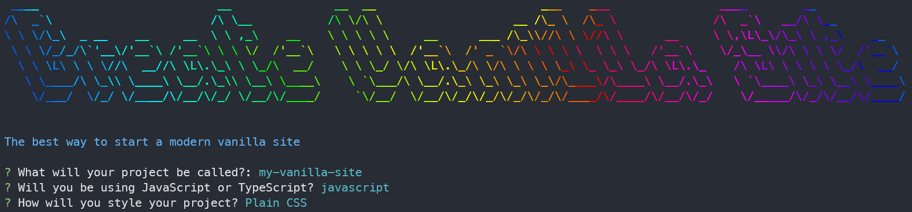

<h1 align="center">Create Vanilla Site</h1>

  <strong>The best way to start a vanilla site 🪄</strong>

---

## What is create-vanilla-site?

A CLI tool for creating vanilla websites easily.  
Vanilla = html + css/tailwind + js/ts

  

## How to run locally

### Prerequisites

- [nodejs](https://nodejs.org/en/)

1. Clone the repository
1. Run `yarn install`
1. Run `yarn build` on the root directory
1. Run `npm link` on the root directory
1. Run `create-vanilla-site` anywhere on your system
